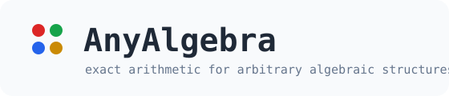
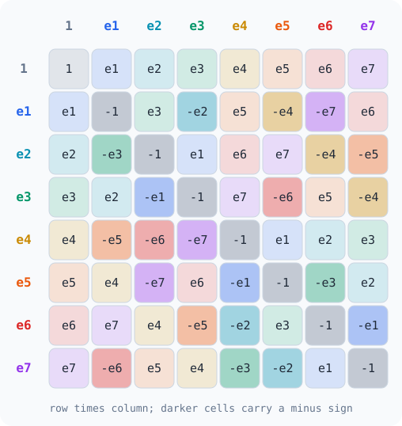
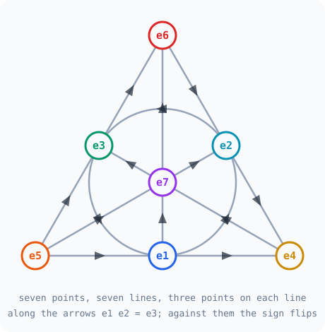
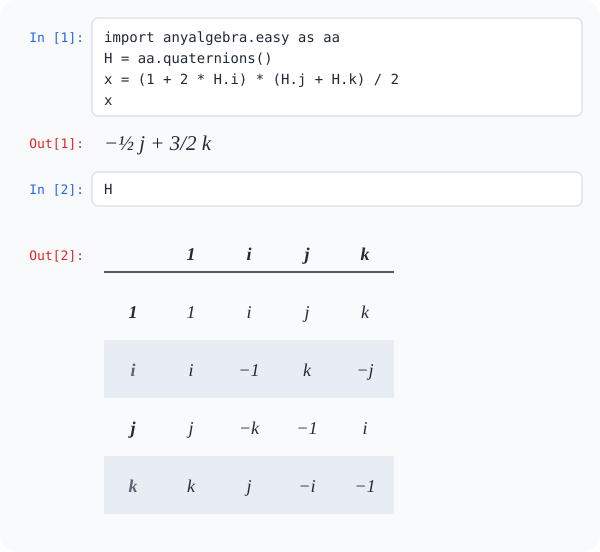

<p align="center">
  
</p>

<p align="center">
  <a href="https://github.com/davidQuantumGravity/anyalgebra/actions/workflows/ci.yml"></a>
  
  
  
  <a href="LICENSE"></a>
</p>

AnyAlgebra is a Python package for exact work with algebraic structures: the
ones in the textbooks, and any you care to invent. You describe a structure,
and the package multiplies in it, checks its laws, finds counterexamples, and
prints the results readably. All arithmetic is exact, in integers and
fractions. It has no dependencies and needs Python 3.11 or newer.

**Contents:** [What is an algebraic structure?](#what-is-an-algebraic-structure) ·
[Install](#install) ·
[Use a built-in algebra](#1-use-a-built-in-algebra) ·
[Build your own algebra](#2-build-your-own-algebra) ·
[Build any structure](#3-build-a-structure-that-is-not-an-algebra) ·
[Ask questions](#4-ask-questions) ·
[The default set](#the-default-set) ·
[Print forms](#print-forms)

## What is an algebraic structure?

An algebraic structure is a set together with one or more operations on it.
The integers with addition are one. So are the rotations of a cube with
"do one, then the other", and the three hands of rock-paper-scissors with
"the winner".

What separates one structure from another is which **laws** its operations
obey. Is `a*b = b*a`? Is `(a*b)*c = a*(b*c)`? Ordinary numbers obey both. The
quaternions drop the first, the octonions drop the second as well, and a
structure you make up yourself may obey neither. A law is a claim about every
element, so it has exactly two honest answers: a proof, or one concrete
counterexample.

An **algebra** is the kind physicists meet most: a vector space whose basis
elements can be multiplied. Its whole multiplication is fixed by a table that
says what each pair of basis elements gives. Here is that table for the
octonions, drawn from the package's own data:

<p align="center">
  
</p>

Seven lines carry the same information. Each line below holds three units
whose products stay on the line, and the arrows give the sign. This is the
Fano plane, and it too is drawn from the table rather than by hand:

<p align="center">
  
</p>

AnyAlgebra works with all of these. You can take a structure from the default
set, build an algebra from a table, or build a structure from any set and any
operation.

## Install

AnyAlgebra is not on a package index yet. Install it from a clone:

```powershell
git clone https://github.com/davidQuantumGravity/anyalgebra.git
cd anyalgebra
python -m venv .venv
.venv\Scripts\Activate.ps1   # on Linux or macOS: source .venv/bin/activate
python -m pip install -e .
```

## 1. Use a built-in algebra

```python
import anyalgebra.easy as aa

O = aa.octonions()
O.inject()                      # defines e1 ... e7

print(e1 * e2)
print((e1 * e2) * e4 - e1 * (e2 * e4))
x = (1 + 2 * e1) * (e2 + e4) / 2
print(x)
```

```text
e3
2*e7
1/2*e2 + e3 + 1/2*e4 + e5
```

The second line is not zero, so the octonions are not associative, and the
package has just shown it with a concrete triple. Python evaluates `a * b * c`
from left to right, so write the parentheses when the order matters.

## 2. Build your own algebra

Give the basis labels and say what each pair multiplies to. A pair you leave
out multiplies to zero. This is the cross product of three-dimensional space:

```python
cross = aa.algebra(
    ("x", "y", "z"),
    {("x", "y"): "z", ("y", "z"): "x", ("z", "x"): "y",
     ("y", "x"): "-z", ("z", "y"): "-x", ("x", "z"): "-y"},
    name="cross", unit=None,
)
print(cross.table())
print(cross.report())
```

```text
      x   y   z
x     0   z  -y
y    -z   0   x
z     y  -x   0
cross: basis x, y, z
  dimension             3
  commutative           False
  associative           False
  unit                  absent
  center dimension      0
  nucleus dimension     0
  derivation dimension  3
```

The report is computed, not looked up. The three derivations it finds are the
infinitesimal rotations.

## 3. Build a structure that is not an algebra

Any finite set and any function of two elements will do. The function may
return `None` where the operation is undefined.

```python
hands = ("rock", "paper", "scissors")
beats = {("paper", "rock"), ("scissors", "paper"), ("rock", "scissors")}
game = aa.magma(hands, lambda a, b: a if a == b or (a, b) in beats else b, name="RPS")
print(game.report())
```

```text
RPS: 3 elements, total operation *
  identity: none
  commutative: all 9 pairs agree
  not associative: (rock*paper)*scissors = scissors, but rock*(paper*scissors) = rock
  idempotent: x*x = x for every element
```

Every line is a proof over all cases or a counterexample you can check by
hand.

A structure may have several sets, and operations with any number of
arguments. Here three turns act on the corners of a triangle, and a
reflection swaps two corners. A law is a function that returns the two sides
of an equation:

```python
corners = "abc"
triangle = aa.structure(
    {"turn": (0, 1, 2), "corner": tuple(corners)},
    {
        "add": ("turn turn -> turn", lambda m, n: (m + n) % 3),
        "move": ("turn corner -> corner", lambda n, p: corners[(corners.index(p) + n) % 3]),
        "flip": ("corner -> corner", {("a",): "a", ("b",): "c", ("c",): "b"}),
    },
    name="triangle",
)
move, add, flip = triangle.move, triangle.add, triangle.flip
print(triangle.check("action", lambda m, n, p: (move(m, move(n, p)), move(add(m, n), p)), "turn turn corner"))
print(triangle.check("flip commutes", lambda n, p: (flip(move(n, p)), move(n, flip(p))), "turn corner"))
```

```text
action: holds for all 27 assignments
flip commutes fails at n = 1, p = a: left side = c, right side = b
```

The kernel underneath adds typed terms, proof records and deductive systems,
described in the [capabilities guide](docs/capabilities.md).

## 4. Ask questions

The family modules decide the classical questions exactly:

```python
import anyalgebra.composition as ca
import anyalgebra.jordan as aj
import anyalgebra.lie as al
import anyalgebra.matrix_lie as ml

print(ca.is_alternative(ca.octonions()), ca.is_alternative(ca.sedenions()))
J = aj.hermitian(ca.octonions(), 3)
print(J.rank, aj.is_jordan(J))
g = ml.sl(2, ca.octonions())
print(g.dimension, g.killing_signature(), al.so(9, 1).killing_signature())
```

```text
True False
27 True
45 (9, 36, 0) (9, 36, 0)
```

In words: the octonions are alternative and the sedenions are not; the
3-by-3 Hermitian octonionic matrices form a 27-dimensional Jordan algebra;
and the 2-by-2 octonionic matrices generate a 45-dimensional Lie algebra with
the same Killing-form signature as `so(9,1)`.

A check on basis elements is not a proof for every element. For that, give
an element symbols for coordinates. One calculation with polynomials then
settles an identity for all elements at once:

```python
print(aa.quaternions().generic("a").norm())
print(O.identity("alternative", lambda x, y: aa.assoc(x, x, y)))
print(O.identity("norm is multiplicative", lambda x, y: ((x * y).norm(), x.norm() * y.norm())))
print(O.identity("associative", lambda x, y, z: aa.assoc(x, y, z)))
```

```text
a0^2 + a1^2 + a2^2 + a3^2
alternative: an identity in 16 symbols, so it holds for every element
norm is multiplicative: an identity in 16 symbols, so it holds for every element
associative fails at x = e1, y = e2, z = e4: the difference is 2*e7
```

The second line is the eight-square identity, proved in a few milliseconds.
Two or more algebras can be set side by side:

```python
print(aa.compare(aa.quaternions(), O, aa.split_octonions()))
```

```text
                      H        O        Os
dimension             4        8        8
commutative           False    False    False
associative           True     False    False
unit                  present  present  present
center dimension      1        1        1
nucleus dimension     4        1        1
derivation dimension  3        14       14
```

## The default set

```python
print(aa.catalog())
```

```text
aa.quaternions(), aa.octonions()              H and O in our conventions
aa.split_quaternions(), aa.split_octonions()  their split forms
aa.algebra(labels, table)                     any algebra from a table of basis products
aa.magma(elements, function)                  any finite set with a binary operation
aa.structure(sorts, operations)               several sets, operations of any arity
A.generic(), A.identity(name, law)            symbolic elements; identities for all x
aa.compare(A, B)                              exact fingerprints side by side
ca.reals(), ca.complexes(), ca.quaternions()  the Cayley-Dickson chain
ca.octonions(), ca.sedenions()                ... through dimension 16
ca.split_complexes(), ca.split_octonions()    split forms by doubling
ca.cayley_dickson(A), ca.tensor(A, B)         doubling and tensor products
am.matrix(A, rows)                            matrices over any algebra
al.so(p, q), al.su(p, q), al.sl(n), al.sp(n)  classical Lie algebras
al.root_system(family, rank)                  root systems of types A to G
ls.identify(g), ls.root_decomposition(g)      which Lie algebra is this
ac.clifford(p, q, r), ac.grassmann(n)         Clifford and exterior algebras
ac.gamma_matrices(p, q)                       exact gamma matrices in any signature
aj.hermitian(A, n)                            Hermitian Jordan algebras; J3(O) is the Albert algebra
aj.tensor_jordan(A, n, B)                     the carrier A tensor J_n(B)
ml.su(n, A), ml.sl(n, A)                      matrix Lie algebras over R, C, H, O
```

| Guide | Covers |
|---|---|
| [Convenience layer](docs/api/easy.md) | symbols, operators, print forms, tables, reports |
| [Composition algebras](docs/api/composition.md) | Cayley-Dickson algebras, involutions, tensor products |
| [Algebra families](docs/api/families.md) | matrices, Lie, Clifford, Jordan, matrix Lie algebras |

## Print forms

One element, several ways to show it, chosen per call, per block, or as a
default:

```python
print(f"{x}")
print(f"{x:v}")
print(f"{x:p}")
print(f"{x:l}")
print(f"{x:w}")
```

```text
1/2*e2 + e3 + 1/2*e4 + e5
[0, 0, 1/2, 1, 1/2, 1, 0, 0]
½ e₂ + e₃ + ½ e₄ + e₅
\frac{1}{2}\,e_{2} + e_{3} + \frac{1}{2}\,e_{4} + e_{5}
1/2 e2 + 1 e3 + 1/2 e4 + 1 e5
```

These are the sum, vector, pretty, LaTeX and Wolfram Language forms. The last
can be pasted into Mathematica. There is an HTML form as well, and a new form
is one small function. Tables can be ruled:

```python
print(aa.quaternions().table(rules=True))
```

```text
   │   1   i   j   k
───┼─────────────────
 1 │   1   i   j   k
 i │   i  -1   k  -j
 j │   j  -k  -1   i
 k │   k   j  -i  -1
```

In a notebook nothing needs to be asked for: an element displays as
mathematics and an algebra as its table. The drawing below is generated from
the values the package returns for these two cells.

<p align="center">
  
</p>

## What this adds to a computer-algebra notebook

- **Proof or counterexample.** A law check never returns "probably": it
  covers every case or names the first one that fails.
- **No rounding.** Every coefficient is an integer or a fraction.
- **Order is explicit.** Nonassociative products are never silently
  re-bracketed, and elements of two different structures never mix.
- **Every element at once.** With symbolic coordinates an identity is proved
  for all elements, not sampled on a few.
- **Any structure.** Tables, functions, partial operations, several sets and
  operations of any arity, not only the named algebras.
- **Replayable evidence.** A calculation can be recorded with its inputs and
  conventions and replayed later; see the
  [evidence model](docs/evidence/evidence-model.md).

The [finite algebra census and atlas manual](docs/guides/finite-algebra-census.md)
walks through enumerating and classifying small algebras, and the
[quaternion and octonion guide](docs/guides/quaternions-and-octonions.md)
covers the composition algebras in depth.

### Experimental namespace

`anyalgebra.experimental` holds research code built on the kernel: an exact
Albert-algebra and compact-F4 control, the magic-square catalogues, the
Baker--Campbell--Hausdorff series, and exact checks for tables of structure
constants. Constructions of exceptional Lie algebras built with these tools
are being prepared for publication and are not part of this repository yet.
Experimental modules may change without notice.

### Not implemented yet

Group-level transformations, representations and branching rules, spinor
basis changes, and Fierz identities are not implemented. Symbolic
coefficients are polynomials only: there is no factoring or simplification
of radicals. There is no universal `GL(n, A)` for an arbitrary nonassociative
`A`; the matrix Lie module covers the cases that have an accepted definition
and rejects the others.

## Status

The source reports version `0.1.9`, tagged `v0.1.9`; `v0.1.8` is the earlier
tag. The 0.1.0 milestone
closed all 60 planned v0.1 tasks, and its final task, `V01-060`, passed its
readiness gate. The convenience layer and the family modules were added
afterwards as the v0.1.x patches; they are tested against textbook
statements, and their interfaces may still change.

No signed archive or package-index publication exists yet. The
[current status](docs/status.md) page records the exact test, coverage, and
artifact evidence and its boundaries.

These are engineering results. They do not establish correctness, a
general algebra classification, or a physics claim. No project/scientific claim
follows from a passing package or atlas gate.

## Development

```powershell
python -m pip install -e ".[dev]"
python -m ruff format --check src tests examples tools
python -m ruff check src tests examples tools
python -m mypy src tests
python -m pytest -q -m "not legacy and not optional_backend"
```

The neutral suite is large. For a quicker run, leave out the long exact
computations, which carry the `slow` marker:

```powershell
python -m pytest -q -m "not legacy and not optional_backend and not slow"
```

Tests in `tests/legacy` compare against a pinned legacy Mathematica package
and are excluded from the neutral run. A few tests audit maintainer process
records that are not part of this repository; they skip with an explicit
reason.

An equivalent UV-managed setup is:

```powershell
uv sync --extra dev
uv run python -m pytest -q -m "not legacy and not optional_backend"
```

Two release tools build temporary wheel and source distributions, clean-install
them, and reproduce the reference atlas from each. They do not retain or
publish anything. Both run `uv` and by default use only its local cache; add
`--allow-network` to let it download the build backend:

```powershell
python tools/check_v0_1_artifacts.py .
python tools/reproduce_v0_1_atlas.py .
```

The package must import with its required dependencies alone. Optional
adapters belong behind capability interfaces and stay out of the neutral-core
import path.

## Documentation

[`docs/README.md`](docs/README.md) is the index and defines which document
controls when two disagree. The main entries are the
[architecture decisions](docs/architecture/architecture-decisions/README.md),
the [conventions](docs/conventions/conventions-v0.0.md), the
[testing strategy](docs/testing/testing-strategy.md), and the
[evidence model](docs/evidence/evidence-model.md).

## Repository layout

```text
pyproject.toml     # packaging and development-tool configuration
src/anyalgebra/    # the package; only names listed in the API docs are public
tests/             # observable contract tests
docs/              # contracts and guides
examples/          # runnable example scripts
tools/             # release, reproduction, and audit scripts
```

No module becomes public merely because it exists in `src/`. Some documents
refer to process records under `.agents/` and to research notes under
`docs/research/`; those are maintained privately and are not part of this
repository.

## License

AnyAlgebra is free and open-source software under the
[GNU Affero General Public License, version 3 only](LICENSE)
(`AGPL-3.0-only`).

**Researchers, teachers and students can use it for free, without asking
anyone.** No payment and no permission are needed when the terms of the AGPL
are followed, and the same holds for nonprofit and commercial use.

| You want to | What the license means |
|---|---|
| Download it and run calculations | Allowed. No fee and no approval. |
| Change it for your own research | Allowed. Your changes can stay private as long as you neither give the software to others nor let others use your modified version over a network. |
| Publish equations, numbers, plots or papers | Your results are yours. They do not fall under the AGPL because AnyAlgebra helped produce them. |
| Share copies, or software built on it | Allowed. Keep the notices, include the license, and make the corresponding source available. |
| Run a modified version as a website or API | Allowed. Offer the corresponding source of your version, prominently, to the people who use it over the network. |

Two points are easy to miss:

- Distributing an application that combines your code with AnyAlgebra can
  bring the combined program under the AGPL, even if AnyAlgebra's own files
  are unchanged.
- The network condition also applies inside an institution. A modified
  version offered to other users on a university network counts. Academic
  status does not waive the terms.

This is a summary for orientation, not legal advice. The
[license text](LICENSE) controls.

### A separate proprietary license

This matters only if you want to do something the AGPL does not allow:
building AnyAlgebra into a closed-source application, or into a hosted
service, without releasing the resulting work under the AGPL. In that case
you may ask the maintainer for a separately negotiated license. Requests of
that kind from academic and nonprofit organizations are considered case by
case, like any other. Ordinary academic use needs no request at all. See
[Commercial licensing](COMMERCIAL-LICENSING.md) for the scope and how to get
in touch. No proprietary permission exists until separate written terms are
agreed.

Unless a file or directory says otherwise, original material in this
repository is covered by the repository license. Third-party material remains
subject to any separate notices that accompany it.
